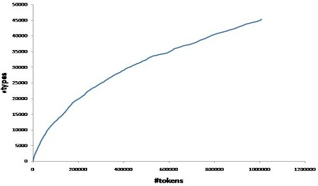

 As we gather larger copora (more instances of tokens), the corresponding number of distinct types gets diminished as we exhaust the discovery of full vocabulary. This phenomenon can be explained by the Heap's law which is formulated as:

V = f(n) = Kn¦Â

where V = types
          n = tokens
          K and ¦Â are free parameters determined empirically

